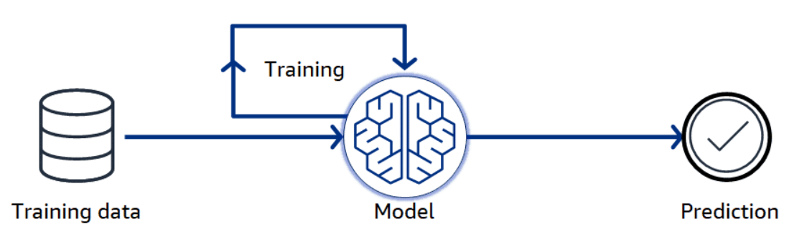

## Inteligencia Artificial 

La IA, también conocida como inteligencia artificial, es una tecnología con capacidades de resolución de problemas similares a las de los seres humanos. En la práctica, la IA parece simular la inteligencia humana: es capaz de reconocer imágenes, escribir poemas y realizar predicciones basadas en datos. 

Las organizaciones modernas recopilan grandes volúmenes de datos procedentes de diversas fuentes, como sensores inteligentes, contenido generado por personas, herramientas de supervisión y registros del sistema. Las tecnologías de inteligencia artificial analizan los datos y los utilizan para facilitar las operaciones empresariales de forma eficaz. Por ejemplo, la tecnología de IA puede responder a conversaciones con personas en el servicio de atención al cliente, crear imágenes y textos originales para marketing y ofrecer sugerencias inteligentes para el análisis de datos.

En definitiva, la inteligencia artificial consiste en hacer que el software sea más inteligente para ofrecer interacciones personalizadas con los usuarios y resolver problemas complejos.

##  Machine Learning 

El aprendizaje automático (ML) es un conjunto de técnicas de inteligencia artificial que utilizan datos existentes para entrenar un modelo matemático. El modelo aprende a reconocer patrones en los datos con los que se le ha entrenado. Posteriormente, el modelo puede realizar predicciones precisas cuando se le presentan nuevos datos de entrada.

Los enfoques tradicionales de ML utilizan algoritmos para construir sus modelos. Un modelo de ML es el resultado final del proceso de entrenamiento, en el que el algoritmo se ha aplicado a un conjunto de datos y ha aprendido a realizar predicciones o tomar decisiones. Los algoritmos han evolucionado hacia arquitecturas de modelos más avanzadas, como las redes neuronales, que se caracterizan por complejas disposiciones de capas, neuronas y conexiones.

Los continuos avances en las arquitecturas de los modelos, combinados con la disponibilidad de enormes cantidades de datos y una computación en la nube más potente, han hecho posibles nuevas técnicas de aprendizaje automático, incluida la IA generativa.

El concepto de predicción varía mucho en función de la aplicación, pero, en esencia, el modelo predice algo basándose en lo que ha aprendido de los datos de entrenamiento. Por ejemplo, podría tratarse de algo muy específico, como determinar si una transacción es fraudulenta, o de algo más amplio, como solicitar recomendaciones de restaurantes.

###  ¿Cuando se debe usar un modelo de machine learning ?
Determinar si el aprendizaje automático es el enfoque adecuado

Antes de decidir qué técnicas de aprendizaje automático utilizar, debes determinar si el aprendizaje automático es el enfoque adecuado para el problema que intentas resolver.

Las soluciones de análisis de datos utilizan técnicas de programación más tradicionales para analizar grandes conjuntos de datos y obtener información útil. Si las variables son limitadas y las reglas de negocio pueden codificarse de forma fija, el análisis de datos podría ser la mejor opción.

Sin embargo, aunque la complejidad del problema sugiera que podría ser necesario el aprendizaje automático, es importante tener en cuenta factores adicionales antes de empezar a desarrollar una solución de aprendizaje automático.

Una consideración importante es si dispones o puedes obtener suficientes datos de entrenamiento relevantes y de alta calidad. Sin suficientes datos de calidad, no es posible entrenar el modelo para que realice buenas predicciones.

Incluso con buenos datos, es posible que el aprendizaje automático no sea una opción para problemas que tengan requisitos muy estrictos.

Si puede obtener los datos y los requisitos de su aplicación son lo suficientemente flexibles como para permitir un enfoque de aprendizaje automático, considere el coste y los beneficios de una solución de aprendizaje automático. Las organizaciones deben decidir si el impacto de la solución compensa el coste de entrenar, implementar y gestionar una solución de aprendizaje automático. La disponibilidad de recursos y servicios en la nube ayuda a las organizaciones a experimentar más y a adquirir experiencia con herramientas y técnicas de aprendizaje automático que les ayuden a encontrar un enfoque con un coste optimizado.

Tipos generales de datos que puede utilizar el aprendizaje automático

Los datos se pueden clasificar en tres tipos generales: estructurados, semiestructurados y no estructurados.

Dependiendo del problema que se intente resolver

|  Datos estructurados |    Datos no estructurados     |   Datos Semi-Estructurados |
| -------------------- |  --------------------------   |  --------------------------|
| Los datos estructurados se almacenan en un formato tabular, como los registros de una base de datos relacional tradicional. Los datos se organizan según una estructura que define y estandariza los elementos de datos y su relación entre sí. Esta organización de los datos hace que los datos estructurados sean más fáciles de consultar, pero no muy flexibles.      | Los datos no estructurados no tienen una estructura predefinida. Por ejemplo, los documentos de texto, los archivos de audio y las imágenes se describen de formas diferentes. Los archivos de audio tienen una duración. Las imágenes pueden tener una resolución. Los documentos de texto pueden no tener ni duración ni resolución. Esta estructura indefinida hace que los datos no estructurados sean más complejos de analizar. Sin embargo, con las herramientas adecuadas, este tipo de datos se puede utilizar de forma más flexible que los datos con estructuras rígidas.   | Semistructured data uses tags or other markers to separate and define elements within the data. This approach is less rigid and less formal than structured data but still provides some level of organization that reduces the complexity of working with the data. For example, an email has some amount of structure (subject, sender, recipient, body, and date), but some of those fields can vary greatly from one email to another. JSON and XML are both examples of semistructured formats that use tags to identify elements.              |
|                      |                               |                            |
|                      |                               |                            |

###  Deep Learning  and IA Generativa 

Aprendizaje profundo

Las redes neuronales constan de una capa de entrada, por donde se introducen los datos en la red, una capa de salida que genera la predicción final y una o más capas ocultas, donde tiene lugar el procesamiento complejo. Los modelos más complejos cuentan con más capas. Lo que distingue a los modelos de aprendizaje profundo de otros modelos de aprendizaje automático es el volumen y la variedad de datos con los que se entrenan, así como la profundidad resultante (número de capas) del propio modelo.

Los complejos modelos de redes neuronales utilizados para el aprendizaje profundo destacan por su capacidad para detectar patrones en datos no estructurados y modelar relaciones complejas. Esta capacidad para detectar patrones y modelar relaciones hace que las redes neuronales sean idóneas para tareas complejas de inteligencia artificial. Una diferencia clave entre los modelos tradicionales de aprendizaje automático y los de aprendizaje profundo es que los primeros suelen contar con un conjunto de datos bien definido y han sido entrenados para utilizar un conjunto de puntos de datos con el fin de realizar una predicción específica. Por ejemplo, si tuvieras un modelo de transacciones históricas etiquetadas, entrenado para detectar cuándo una transacción podría ser fraudulenta, podrías obtener resultados que indicaran transacciones fraudulentas.

IA generativa

La IA generativa utiliza modelos de aprendizaje profundo denominados «modelos base o fundacionales » (FM, por sus siglas en inglés). 

Estos modelos se han entrenado previamente con enormes cantidades de datos. 

El resultado de este entrenamiento es que pueden responder a solicitudes más generalizadas, independientemente de si la 

solicitud específica ha formado parte de su entrenamiento.

Las predicciones de los modelos base dan lugar a nuevos contenidos; por ejemplo, un conjunto de respuestas en lenguaje natural 

en un diálogo conversacional o la generación de una imagen nueva basada en una descripción solicitada. 

Estas características hacen que los modelos fundacionales resulten atractivos para un abanico mucho más amplio de casos de uso. 

El modelo entrenado puede utilizarse para aplicaciones que no se hayan definido de antemano.

##  Servicios clave de AWS para el desarrollo de IA a lo largo de todo su ciclo de vida

### Amazon Elastic Compute Cloud (Amazon EC2) instance

Requisito: Utilizar una infraestructura informática diseñada para optimizar el rendimiento, el coste y la sostenibilidad de las cargas de trabajo de IA.

Utilizar los tipos de instancias de Amazon Elastic Compute Cloud (Amazon EC2), entre los que se incluyen los siguientes:

Instancias Amazon EC2 Trn1 y Trn2

Instancias Amazon EC2 Inf1 e Inf2

Instancias Amazon EC2 P4 y P5

### Amazon SageMaker AI.

Requisito: Crear, entrenar e implementar modelos de aprendizaje automático, incluidos los modelos de función de mezcla (FM), con una infraestructura, herramientas y flujos de trabajo totalmente gestionados.

Utiliza Amazon SageMaker AI.

### Amazon Bedrock.

Requirement: Build and scale generative AI applications using existing foundation models and integrate with AWS services.

Use Amazon Bedrock.

AWS ofrece numerosos servicios que proporcionan modelos preentrenados. Entre ellos se incluyen los siguientes:

IA generativa: Amazon Q

Procesamiento del lenguaje: Amazon Transcribe, Amazon Polly y Amazon Translate

Análisis aumentado: Amazon Textract y Amazon Comprehend

Visión artificial: Amazon Rekognition