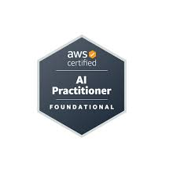

# IA Practitioner AWS Trainer

Soy Santiago, y este repositorio representa mi proceso de aprendizaje y documentación sobre IA Practitioner de AWS Trainer. Aquí voy a registrar de forma organizada los conceptos, ejercicios y aprendizajes que me permitan fortalecer mis conocimientos en inteligencia artificial aplicada a la nube.

Este proyecto se presenta como una guía no oficial, pensada para complementar mi estudio, compartir conocimiento de manera clara y servir como referencia personal en mi camino de formación.

Quiero que este espacio sea útil para otras personas interesadas en aprender, y si encuentras valor en este contenido, te invito a dejar una estrellita en el repositorio para seguir motivándome a compartir conocimiento.

Gracias por acompañarme en este recorrido de aprendizaje. @aws

Este trabajo está bajo una [Licencia Creative Commons Atribución 4.0 Internacional](https://creativecommons.org/licenses/by/4.0/deed.es).