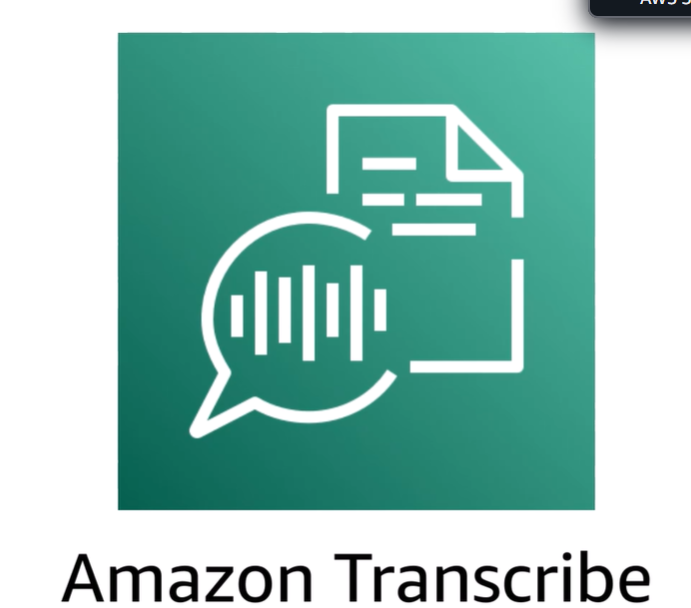

 Tienes una grabación de audio importante en inglés, tal vez una reunión, una presentación o los comentarios de un cliente, y necesitas compartirla con compañeros o clientes de habla hispana. 

 Antes de la IA, esto habría requerido varios especialistas y días de trabajo. Ahora, puedes hacerlo en cuestión de minutos utilizando tres potentes herramientas de IA que funcionan conjuntamente. El primer paso es la transcripción con Amazon Transcribe. En primer lugar, toma tu archivo de audio y súbelo a Amazon Transcribe. Esta herramienta de IA escucha la grabación y convierte las palabras habladas en texto escrito. Así de sencillo es. Inicia sesión en tu cuenta de Amazon Web Services. Escribe «transcribe» en la barra de búsqueda. Selecciona «Amazon Transcribe». Elige «Trabajos de transcripción» en el menú de navegación de la izquierda. Selecciona «Crear trabajo». Introduce un nombre único en el campo correspondiente. Asegúrate de que el inglés está seleccionado como idioma de origen. Deja el resto de opciones de la sección tal y como están por defecto. Tu archivo ya debería estar subido a un bucket de S3. Si no es así, crea un bucket y sube tu archivo. Selecciona el botón «Examinar S3» y, a continuación, navega hasta tu archivo. Selecciona tu archivo. Deja todo tal y como está por defecto y selecciona «Siguiente». Desplázate hacia abajo y selecciona «Crear trabajo». Lo que ocurre entre bastidores es fascinante. La IA analiza los patrones de sonido y los compara con las palabras que conoce. Incluso gestiona diferentes acentos, ruido de fondo y múltiples hablantes. Una vez completado el trabajo, selecciona el enlace del trabajo, desplázate hacia abajo más allá del resumen del trabajo y tendrás acceso a una vista previa de la transcripción. Selecciona el texto en la vista previa de la transcripción y cópialo. El paso 2 es la traducción. Una vez que tengas tu transcripción en inglés, debes traducirla al español. La IA utiliza complejas redes neuronales para comprender no solo las palabras, sino también el contexto y el significado. A continuación te explicamos cómo hacerlo. Escribe «translate» en la barra de búsqueda. Selecciona «Amazon Translate». En la página de traducción en tiempo real, pega tu texto en el campo «Introducir texto». El idioma de origen está configurado en «automático», por lo que reconoce automáticamente que el texto está en inglés. También podemos utilizar el menú desplegable para seleccionar «inglés». Para el idioma de destino, puedes utilizar el menú desplegable como campo de búsqueda. Escribe «español». Selecciona «Español (ES)». El texto traducido debería cambiar de inglés a español. La IA no se limita a sustituir palabras, sino que reestructura las frases para mantener el significado y la fluidez natural en español. Es mucho más sofisticada que las herramientas de traducción de hace tan solo cinco años. Selecciona el texto en el campo de texto traducido y cópialo. Necesitarás el texto traducido para el último paso. El paso 3 consiste en la síntesis de voz con Amazon Polly. Cogerás tu texto en español y lo convertirás de nuevo en audio hablado utilizando Amazon Polly. El proceso es sencillo. Escribe «Polly» en la barra de búsqueda. Selecciona «Amazon Polly». En el campo de texto de entrada, pega tu texto en español. En «Idioma», elige «Español (EE. UU.)». Ten en cuenta que algunos idiomas no están disponibles; esto depende del motor que elijas. En «Voz», elige una voz en español que se adapte a tus necesidades. Polly ofrece varias opciones con diferentes acentos y géneros. Selecciona «Descargar» para descargar tu nuevo archivo de audio en español. 

El servicio «Imagine Scenario Audio» de Amazon Poly utiliza tecnología neuronal avanzada de conversión de texto a voz para crear voces con un sonido extraordinariamente natural. La entonación, el ritmo y la pronunciación suenan auténticamente humanos. Este proceso de tres pasos transforma la forma en que las personas pueden comunicarse más allá de las barreras lingüísticas. Lo que antes llevaba días, ahora se hace en minutos. Lo que antes costaba cientos o miles de dólares, ahora cuesta una fracción de esa cantidad. Este flujo de trabajo supone un cambio revolucionario. Imagina crear materiales de formación en varios idiomas, traducir llamadas de atención al cliente o hacer que el contenido sea accesible para una audiencia global, todo ello en una fracción del tiempo que llevaría hacerlo manualmente. Lo mejor de todo es que no hace falta ser un genio de la tecnología para utilizar estas herramientas. Están diseñadas para ser fáciles de usar e integrarse a la perfección en nuestros flujos de trabajo diarios. A medida que empieces a utilizarlas, descubrirás formas aún más creativas de sacar partido a las soluciones basadas en la inteligencia artificial.

